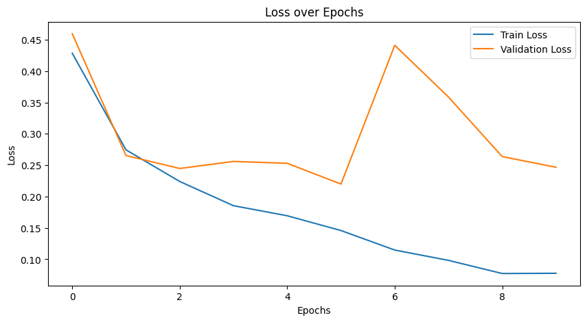

# CHEST X-RAY Class Identification / Experiments
### Jay Hwasung Jung
### Deep Learning in Biomedical Enginnering

## **Dataset Details**
The dataset is publicly available from <a href="https://www.kaggle.com/datasets/tawsifurrahman/covid19-radiography-database">Kaggle</a>. It includes four classes of chest X-rays:

- **Normal:** 10,192 images
- **Lung Opacity:** 6,012 images
- **Viral Pneumonia:** 1,345 images
- **COVID-19:** 3,616 images

Each image is the size of 256 x 256. However, I transformed it in to 224 x 224 for transfer learning.

##  **Previous Work**

What Makes Transfer Learning Work For Medical Images Feature Reuse & Other Factors [1]

This paper highlights that most pretrained image models are trained on ImageNet, and the smaller the FID score from ImageNet, the more likely transfer learning is to be successful. They also present results from the CheXpert dataset, which is similar to the dataset used in this project. In conclusion, the authors found that transfer learning is beneficial in most cases.

## **Objective**
The primary objective of this experiment is to classify chest X-rays into four classes with high accuracy and to evaluate the **effects of Transfer Learning and Fine Tuning** by varying the number of frozen layers. 

## **Modeling and Experiments**
### **Models Used**
1. **ResNet-18 and ResNet-34:**
   - Conducted experiments to assess the performance of these models.
   - Investigated the necessity of fine-tuning and evaluated how many layers should be trained.
        - The effects of using a pretrained model were tested by modifying the pretrained parameter. Setting `pretrained=True` downloads and loads weights pretrained on ImageNet. In contrast, setting `pretrained=False` initializes the model with randomly generated weights.
        - The effects of fine tunning were tested by freezing first n layers and only training on last few layers. 4 different conditions is applied here; resnet18 half, resnet34half, resnet 18 three quater, resnet 34 three qurter.
        - The effects of fine-tuning were tested by freezing the initial layers and training only the remaining layers. Four different conditions were applied in this experiment:
            - **ResNet18 (half)**: The first half of the layers in ResNet18 were frozen.
            - **ResNet34 (half)**: The first half of the layers in ResNet34 were frozen.
            - **ResNet18 (three-quarter)**: The first three-quarters of the layers in ResNet18 were frozen.
            - **ResNet34 (three-quarter)**: The first three-quarters of the layers in ResNet34 were frozen.
        - As a baseline, a model without pretrained weights was used. 

Each model was trained for 10 epochs using a learning rate of 0.001. The Adam optimizer was utilized for optimization , and CrossEntropyLoss was employed to calculatethe prediction errors.

2. **Transformer-Based Models:**
   - Applied Transformer-based architectures, including Vision Transformers (ViT), to analyze their effectiveness on this dataset.

## **Results**
### **ResNet**

1. ResNet 18 and ResNet 34 pretrained without fine tuning (only classification head was trained): 

|  |  |
|:--------------------------------------------------------------:|:-------------------------------------------------------------------:|
| Loss over epochs (train vs validation)                           | Confusion Matrix                             |

|  |  |
|:--------------------------------------------------------------:|:-------------------------------------------------------------------:|
| Loss over epochs (train vs validation)                           | Confusion Matrix                             |

2. ResNet 18 and ResNet 34 pretrained with freezing 50% of layers: 

|  |  |
|:--------------------------------------------------------------:|:-------------------------------------------------------------------:|
| Loss over epochs (train vs validation)                           | Confusion Matrix                             |

|  |  |
|:--------------------------------------------------------------:|:-------------------------------------------------------------------:|
| Loss over epochs (train vs validation)                           | Confusion Matrix                             |

3. ResNet 18 and ResNet 34 pretrained with freezing 75% of layers: 

|  |  |
|:--------------------------------------------------------------:|:-------------------------------------------------------------------:|
| Loss over epochs (train vs validation)                           | Confusion Matrix                             |

|  |  |
|:--------------------------------------------------------------:|:-------------------------------------------------------------------:|
| Loss over epochs (train vs validation)                           | Confusion Matrix                             |

4. ResNet 18 and ResNet 34 without pretraining: 

|  |  |
|:--------------------------------------------------------------:|:-------------------------------------------------------------------:|
| Loss over epochs (train vs validation)                           | Confusion Matrix                             |

|  |  |
|:--------------------------------------------------------------:|:-------------------------------------------------------------------:|
| Loss over epochs (train vs validation)                           | Confusion Matrix                             |

Model parameters are saved under model/. 

### **Results Summary**

| Training Type                        | ResNet-18 | ResNet-34 |
|--------------------------------------|-----------|-----------|
| Pretrained without fine-tuning       | 0.9299    | 0.9143    |
| Pretrained with 50% freezing         | 0.9283    | 0.9034    |
| Pretrained with 75% freezing         | 0.9277    | 0.9240    |
| Without pretraining                  | 0.9190    | 0.9199    |

In summary, all models achieved an average accuracy of approximately 91%. However, when using pretrained weights, the validation loss was consistently higher than the training loss, indicating overfitting. Interestingly, in the baseline model without pretrained weights, the validation loss closely followed the training loss, at least for the first 10 epochs.

This difference may stem from the fact that pretrained features are highly task-specific to ImageNet, which reduces the model’s flexibility and its ability to generalize effectively to the X-ray dataset. Additionally, the difference in data characteristics between ImageNet and the X-ray dataset may contribute to this issue. ImageNet consists of 3-channel (RGB) natural images, while the X-ray dataset contains 1-channel (grayscale) images.

As a result, in this case, the model may focus more on gradients (representing density and anatomical structures) rather than other low-level features like edges or textures typically learned in the early stages of training on ImageNet.

|  |  |
|:--------------------------------------------------------------:|:-------------------------------------------------------------------:|
| 50% freezing - pretrained                         | non-pretrained                             |

### **Transformer**
1. pretrained - fine tuned in last four transformer layers

|  |  |
|:--------------------------------------------------------------:|:-------------------------------------------------------------------:|
| Loss over epochs (train vs validation)                           | Confusion Matrix                             |

2. non-pretrained

|  |  |
|:--------------------------------------------------------------:|:-------------------------------------------------------------------:|
| Loss over epochs (train vs validation)                           | Confusion Matrix                             |

### **Results Summary**

| Training Type                        | Accuracy  |
|--------------------------------------|-----------|
| Pretrained        |  0.8312    |
| Non-Pretrained         | -    |

Both the pretrained and non-pretrained models were trained for 10 epochs. The results show that the pretrained model consistently outperformed the non-pretrained model within this limited training period. This outcome might change with a larger number of epochs. The key reasons are that Vision Transformers (ViTs) are computationally expensive compared to ResNets, and starting from random weights makes optimization more challenging. Additionally, the dataset used is smaller than ImageNet, which may lead to difficulties in generalization when training a model from scratch.

### Citation
[1]Matsoukas, C., Haslum, J. F., Sorkhei, M., Soderberg, M., & Smith, K. (2022). What makes transfer learning work for Medical Images: Feature Reuse & Other factors. 2022 IEEE/CVF Conference on Computer Vision and Pattern Recognition (CVPR), 9215–9224. https://doi.org/10.1109/cvpr52688.2022.00901 